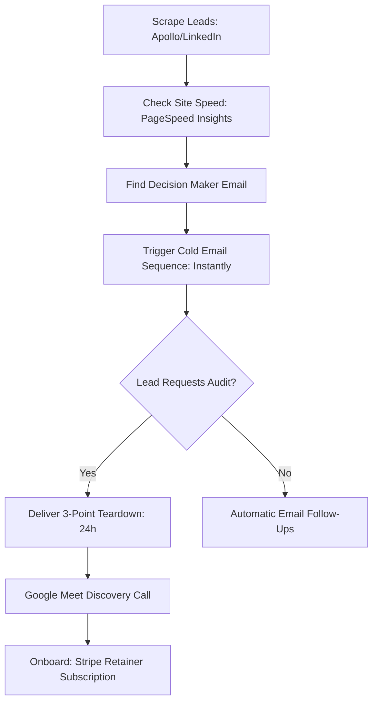

# Grovia Labs — Pre-Launch Playbook & SEO Blueprint

This playbook is your complete operational guide for launching **Grovia Labs** under the domain `grovialabs.in`. It covers technical SEO indexing, explainer video scripting, keyword copywriting mapping, social media schedules, a Product Hunt launch plan, and active outbound client acquisition scripts.

---

## 1. Indexing & Discoverability Checklist

Before pointing your domain to Vercel, ensure this checklist is executed to guarantee that search engines can discover, crawl, and render your site immediately.

### A. DNS & Vercel Configuration
1. **Purchase the Domain:** Secure `grovialabs.in` via your preferred registrar (GoDaddy, Namecheap, Name.com).
2. **Configure DNS Records:** In your registrar's DNS management panel, add these two core records:
   * **A Record:** Host: `@` \| Value: `76.76.21.21` (Vercel’s global IP)
   * **CNAME Record:** Host: `www` \| Value: `cname.vercel-dns.com`
3. **Link Domain in Vercel:** 
   * Go to your Vercel Dashboard -> **grovia-studio** project -> **Settings** -> **Domains**.
   * Enter `grovialabs.in` and click **Add**. Select the option to redirect `www.grovialabs.in` to the root domain.
   * Vercel will automatically verify the DNS records and generate an SSL certificate (which takes 5–15 minutes).

### B. Google Search Console (GSC) Registration
1. Open [Google Search Console](https://search.google.com/search-console).
2. Under the property selector, select **Domain** property type, enter `grovialabs.in`, and click **Continue**.
3. Copy the TXT verification record provided by Google.
4. Go back to your registrar's DNS panel, add a **TXT Record** with Host: `@` (or leave empty) and Value: [Paste the TXT code].
5. Wait 2 minutes, then click **Verify** in Search Console.
6. Once verified, navigate to **Sitemaps** in the left menu, enter `sitemap.xml`, and click **Submit**. Google will read [public/sitemap.xml](file:///Users/shubhamtaneja/Grovia/public/sitemap.xml) and begin crawling.

### C. GMB Verification (Local Search Moat)
1. Log in to [Google Business Profile Manager](https://business.google.com).
2. Open your drafted listing for **Grovia Labs - Landing Page & CRO Agency**.
3. Request/enter the postcard verification code delivered to your Gurugram office (`815, Sector 9A, Gurugram, Haryana, 122001`).
4. Optimize listing metadata:
   * **Title:** `Grovia Labs - Landing Page Design & CRO Agency Gurugram`
   * **Services:** Add custom website builds, B2B sales funnels, conversion optimization, local SEO, and brand identity design.
   * **Business Description:** Match the meta description from your `index.html` to maintain unified local trust.

---

## 2. Process Demo Video Script & Storyboard (90-Seconds)

This script is designed for a 90-second explainer video. It should be embedded directly below the fold in your "How We Work" section or used on LinkedIn/social channels as a pinned intro video.

* **Format:** Screencast + Facecam overlay in bottom corner.
* **Tone:** Authoritative, professional, direct.
* **Duration:** 90 seconds.

| Time | Visual Scene | Audio Voiceover |
|---|---|---|
| **0:00 - 0:15** | Screen shows an active Google/LinkedIn ad dashboard showing clicks, then pans to a slow-loading landing page. Facecam overlay of Shubham. | "If you are running paid ads for your B2B startup, private school, or coaching brand in India, there is a 70% chance you are burning budget. Every time a visitor clicks your ad and waits more than 2 seconds for your page to load, you've paid for a bounce. Slow speed, weak headlines, and friction-filled contact forms are leaking your qualified leads." |
| **0:15 - 0:30** | Visual transitions to a mockup of a standard web agency proposal with a huge retainer cost crossed out. | "Traditional B2B marketing agencies charge bloated monthly retainers and hand off your account to junior designers. Freelancers are faster, but they rarely understand sales strategy or B2B copy. At Grovia Labs, we bridged the gap: agency brains at freelancer rates." |
| **0:30 - 0:50** | Screenshare of the Grovia landing page showcasing sub-1.2s speed results and custom interactive animations. | "We build custom websites, lead funnels, and brand systems engineered to convert. Our process is simple: First, we run a detailed teardown highlighting 3 conversion wins you can fix this week. Then, we design custom glassmorphic interfaces in Figma and build them using clean, custom engineering that loads in under 1.2 seconds." |
| **0:50 - 1:10** | Showcase of the 3 case studies (Apex Coaching, Oakridge Prep, FinFlow SaaS) with bold status metrics highlighting outcomes. | "We don't measure success in deliverables; we measure it in outcomes. Like helping our B2B SaaS clients achieve a 42% boost in demo bookings, or generating 180+ qualified school admission inquiries. We automate the boilerplate code, so we can focus 100% of our time on your copy, speed, and CTA layout." |
| **1:10 - 1:30** | Screencast showing the calendar booking page and the floating WhatsApp widget. | "No pushy sales pitches or long sales cycles. Request a free, personalized 3-point teardown report of your active landing page. We will email it to you in 24 hours. Or, click below to schedule a direct 30-minute Google Meet call to map out your funnel strategy." |
| **1:30 - 1:45** | Title card: Grovia Labs. Wordmark logo and call-to-action details. | "Let's build your growth engine. Go to grovialabs.in and request your teardown today." |

---

## 3. Keyword & Copywriting Mapping

To rank for high-intent queries, your page copywriting must seamlessly integrate targeted B2B keywords without resorting to keyword stuffing.

### A. Core Keyword Mapping Table

| Target Search Term | Search Intent | Landing Page Section | Copy Integration |
|---|---|---|---|
| `fractional marketing team India` | B2B decision-makers seeking partner | Hero Subheadline, About | *"Hire an on-demand fractional marketing team at freelancer rates."* |
| `landing page design agency India` | Ready to hire designer/agency | Hero Title, Services | *"Grovia Labs is a conversion-focused landing page design agency..."* |
| `B2B lead generation funnels India` | Seeking funnel infrastructure | Services overlay, Why Grovia | *"We design and custom-code B2B lead generation funnels that convert ad traffic."* |
| `school marketing agency India` | Private school admissions | About Section, Case Studies | *"Building custom enrollment pipelines for schools and sports academies."* |
| `digital marketing cost in India` | Price investigation | FAQ Section | *"What does a custom conversion website and growth retainer cost?"* |

### B. Suggested Keyword Copy Upgrades (For your vertical landing pages)
If you build out `/saas`, `/schools`, and `/coaching`, use these targeted header and metadata copies:

#### `/saas` Landing Page
* **Meta Title:** `B2B SaaS Landing Page Design Agency | Grovia Labs`
* **Meta Description:** `Maximize your Google and LinkedIn ad conversion rates. We design and custom-code sub-1.2s B2B SaaS landing pages that drive qualified demo bookings.`
* **Hero Headline:** *"Landing pages that secure more SaaS demos."*
* **Supporting Copy:** *"We eliminate ad spend waste by replacing heavy, generic page builders with custom-engineered React funnels. Built for lightning-fast speeds (LCP < 1.2s) and structured B2B copywriting that turns cold traffic into scheduled pipeline."*

#### `/schools` Landing Page
* **Meta Title:** `School Admission Marketing Agency India | Grovia Labs`
* **Meta Description:** `Get more campus tours and qualified student enrollments. Grovia Labs builds trust-focused school websites and admissions marketing funnels in India.`
* **Hero Headline:** *"Admissions funnels that capture parent trust."*
* **Supporting Copy:** *"Private schools and academies don't need generic brochures; they need parent engagement. We build responsive, trust-heavy websites featuring virtual tour CTAs, transparent fee sections, and seamless parent contact forms that drive campus visits."*

#### `/coaching` Landing Page
* **Meta Title:** `Funnel Builder for Coaching & Personal Brands | Grovia Labs`
* **Meta Description:** `Scale your high-ticket consulting or coaching course business. We build premium funnels that capture and pre-qualify high-intent leads.`
* **Hero Headline:** *"Funnels designed to pre-qualify high-ticket coaching leads."*
* **Supporting Copy:** *"Stop chasing low-quality leads. We build structured personal brand funnels that filter and pre-qualify applicants before they ever book a Google Meet call with you."*

---

## 4. Social Content Engine & Calendar

A founder-led authority funnel on LinkedIn and Twitter/X is your fastest source of organic B2B leads. This 4-week calendar focuses on delivering proof and teardowns to build trust.

### A. Weekly Cadence Schedule
* **Tuesday (08:30 AM IST):** The Visual Teardown (Before & After redesign or breakdown of a popular landing page).
* **Thursday (08:30 AM IST):** The Metric Case Study (A deep-dive into speed, LCP improvements, or CRO tactics).

### B. 4-Week Authority Post Calendar

#### Week 1: The Core Web Vitals Trap
* **Post Hook:** *"Why your ₹50k/month Google ad campaign is leaking 30% of its budget before anyone even reads your headline."*
* **Content:** Explain how a 3-second mobile load time causes high-intent prospects to bounce. Share a screenshot of a Google PageSpeed score. Suggest 1 technical fix (lazy-loading images, compressing assets to WebP).
* **Call to Action:** *"Comment 'AUDIT' or click the link in the comments to get a free 15-minute speed and conversion teardown of your page."*

#### Week 2: Stated vs. Actual Problems
* **Post Hook:** *"Founders ask me for 'a modern website redesign.' Here is why that is the wrong goal."*
* **Content:** Detail the difference between a pretty brochure website and a lead generation funnel. Contrast a site that redirects users to an empty footer vs. one that embeds an inline calendar/audit form above the fold.
* **Call to Action:** Link to `grovialabs.in` to request a free audit.

#### Week 3: Before & After Visual Redesign (B2B SaaS)
* **Post Hook:** *"How we redesigned a B2B SaaS landing page to increase demo bookings by 42% (without changing their ad budget)."*
* **Content:** Side-by-side screenshot of an old unoptimized layout vs. a new clean, glassmorphic layout. Explain the exact copywriting changes (shifting from features to outcomes) and friction reduction.
* **Call to Action:** Offer a free audit teardown.

#### Week 4: The School Admission Leak
* **Post Hook:** *"Private schools in India are wasting lakhs on admissions marketing. Here is the funnel mismatch."*
* **Content:** Contrast a typical 12-page school site with a single, conversion-focused admissions landing page built to capture parent contact details and book campus tours.
* **Call to Action:** Target school administrators for a free admissions pipeline review.

### C. Post Copy Template: The CRO Breakdown
Use this template to write posts about client wins:
```text
I just audited a B2B startup page spending over ₹80,000/month on search ads.

They had a beautiful design, but their conversion rate was stuck at 1.8%.

Here are 3 leaks we identified (and fixed) in less than 2 hours:

1. The LCP Speed Issue: They were preloading a 12MB background MP4 above the fold. Mobile load speed was 4.8 seconds. We compressed it and set preload="metadata", cutting load times to 1.1s.

2. The Form Friction: Their demo form had 9 fields, including "Company Size" and "Describe your requirement." We stripped it down to just 2 fields: Website URL + Work Email.

3. The Redirect Loop: Their "Request Audit" CTAs scrolled users to the footer—which had no active form fields. We built an inline submission form directly inside a glassmorphic card.

The Result? A clean, fast, outcome-oriented conversion funnel that doesn't leak paid traffic.

If you are running ads to a page that hasn't been optimized for speed and copy, you are overpaying for leads. 

Drop your website URL below and I'll send you a personalized 3-point teardown report within 24 hours. No sales pitch, just wins.
```

---

## 5. Product Hunt Launch Blueprint

Launching on Product Hunt builds global visibility and generates B2B SaaS inquiries. Follow this blueprint to coordinate your launch day.

### A. Launch Metadata Kit
* **Product Name:** `Grovia Labs`
* **Tagline:** `On-demand fractional marketing & high-speed landing page agency`
* **Primary Category:** `Marketing`, `Developer Tools`, `Design Tools`
* **Description:** `Get agency-level strategy at freelancer rates. Grovia Labs builds custom websites, lead funnels, and brand systems for startups and schools, engineered to load in under 1.2s (LCP) and maximize conversion rates. Powered by custom AI-driven engineering workflows, designed for human conversions.`
* **Pricing Model:** `Free / Services`
* **First Comment (Founder Intro):**
  ```text
  Hi Product Hunt! 👋

  I'm Shubham Taneja, founder of Grovia Labs. 

  After years of designing and custom-coding landing pages for B2B startups and private schools in India, I realized that companies are constantly burned by two things: bloated monthly retainers from traditional agencies, or slow, unoptimized pages from freelancers who don't understand B2B copywriting or conversion strategy.

  We built Grovia Labs to solve this. We merge the strategic positioning and copy standards of a premium agency with the speed, direct access, and pricing of a freelancer. We automate the boilerplate code using custom AI workflows so we can spend 100% of our time on your speed, copy, and visual trust signals.

  We are offering a free, personalized 3-point landing page teardown report delivered to your inbox in 24 hours. No sales call, just 3 concrete wins you can implement immediately to increase conversions.

  I'd love to hear your thoughts, answer questions, and audit your website today! Let's chat in the comments.

  Best,
  Shubham Taneja
  ```

### B. Launch Day Timeline (00:01 AM PST to 11:59 PM PST)
* **00:01 AM PST (12:31 PM IST):** Page goes live. Post your founder comment immediately.
* **12:45 PM IST:** Send the launch announcement to your warm email contacts and past client list.
* **01:00 PM IST:** Publish your LinkedIn launch post (include a clean graphic of the website mockup and pin the Product Hunt link in the comments).
* **03:00 PM IST:** Send personal outreach DMs to 30 friendly founders on LinkedIn, asking for their honest feedback on the launch page.
* **06:00 PM - 09:00 PM IST:** Monitor the comments section on Product Hunt. Reply to every single question or feedback item within 10 minutes (this signals active engagement to the Product Hunt algorithm).
* **11:00 PM IST:** Send a final reminder email/LinkedIn update to your network, highlighting your current ranking and thanking supporters.

### C. Product Hunt Badge Integration
Add a subtle, floating Product Hunt launch badge to the bottom-left of your site on launch day. Add this code inside [App.tsx](file:///Users/shubhamtaneja/Grovia/src/App.tsx):
```tsx
{/* Product Hunt Floating Badge */}
<a 
  href="https://www.producthunt.com/posts/grovia-labs" 
  target="_blank" 
  rel="noopener noreferrer" 
  className="fixed bottom-6 left-6 z-50 hover:scale-105 active:scale-95 transition-all duration-300 pointer-events-auto"
>
  
</a>
```

---

## 6. Active Lead Generation & Outbound Playbook

To hit your ₹12,00,000 ARR target, you need a predictable client acquisition mechanism. This playbook details how to scrape leads, run automated email sequences, and close them on a Google Meet discovery call.



### A. Lead Scraping Parameters
* **Target Industry:** B2B SaaS, E-learning platforms, Private Schools, Coaching and Cohort brands.
* **Location:** Gurugram, Bangalore, Delhi-NCR, Mumbai (India).
* **Employee Size:** 5 - 50 employees (sweet spot for founder-led purchases without complex procurement layers).
* **Keywords to search in Apollo/LinkedIn:** *"Founder"*, *"Marketing Director"*, *"Admissions Head"*.

### B. Cold Outbound Email Sequence (3-Steps)

#### Email 1: The Speed Hook (Day 1)
```text
Subject: quick observation about [Company Name]'s landing page

Hi [First Name],

I noticed you are actively running ad campaigns for [Company Name]. However, clicking through on mobile shows a [X.X second] load time (verified on Google PageSpeed Insights).

Typically, a delay like that bounces up to 25% of your paid traffic before they ever read your copy.

I put together a quick, 3-point conversion teardown of your page highlighting:
1. The exact scripts blocking your LCP load times.
2. A copywriting tweak to make your B2B value proposition clearer.
3. A form layout change to reduce lead booking friction.

It is completely free—you can request the detailed Notion teardown here:
https://grovialabs.in

Or just reply to this email with "Send audit" and I'll drop the Notion link directly in this thread.

Best,
Shubham Taneja
Founder, Grovia Labs
```

#### Email 2: The Proof Follow-up (Day 4)
```text
Subject: Re: quick observation about [Company Name]'s landing page

Hi [First Name],

I know you're busy running [Company Name], so I kept this short.

I recently worked with an Indian B2B startup facing a similar issue—high ad spend, but low demo sign-ups. By compressing their background assets, custom-coding their layout, and aligning their copywriting to B2B outcomes, we reduced their LCP speed to 1.1s and boosted demo bookings by 42% in 30 days.

I'd love to help you find similar conversion wins. Let me know if you'd like me to send over the free 3-point teardown report.

Best,
Shubham Taneja
Founder, Grovia Labs
```

#### Email 3: The Breakup (Day 7)
```text
Subject: last check-in / [Company Name] conversion wins

Hi [First Name],

I assume optimizing your paid ad landing page speed and B2B copywriting isn't a priority for [Company Name] this quarter. Totally understand.

If things change and you want to look into maximizing your ad conversions without increasing your budget, feel free to request your teardown at grovialabs.in or book a call.

Otherwise, this is my final check-in. Wish you the best of luck with your campaigns!

Best,
Shubham Taneja
Founder, Grovia Labs
```

### C. Google Meet Discovery Call Script (The Close)
When a lead schedules a 30-minute Google Meet call to review their teardown, follow this structure to close the deal:

1. **The Agenda (0-3 mins):** 
   * *"Thanks for hopping on, [Name]. Today is simple: I'm going to walk you through the 3 conversion leaks we found on your landing page, show you exactly how to fix them, and answer any technical questions. If there's a fit for us to work together, we can discuss that at the end. Sound good?"*
2. **Review the Teardown (3-15 mins):** 
   * Walk them through their [teardown_template.md](file:///Users/shubhamtaneja/Grovia/marketing-plans/grovia/materials/teardown_template.md). Explain the metrics, speed bottlenecks, and copy changes. Let them speak—ask: *"How is this form currently converting for you?"*
3. **Establish Value (15-20 mins):** 
   * *"We can build and code these exact fixes for you. Our landing pages load in under 1.2s and are custom-coded in React. This typically reduces ad bounce rates by 20-30%, instantly making your paid ads more efficient."*
4. **Present the Offer & Packages (20-25 mins):**
   * *"We operate in two ways: We can build a custom, conversion-optimized funnel for a one-time fee of ₹50,000. Or, if you are actively scaling campaigns, we can run a monthly Growth Engine Retainer for ₹20,000/month where we continuously build new ad variations, monitor speed, and run CRO tests. Which model fits your current focus?"*
5. **Close & Onboard (25-30 mins):**
   * *"Great. I will email you the contract link and a Stripe invoice/subscription link. Once signed, we'll hop on a 20-minute onboarding call next week to collect your brand assets and launch the build."*

***

*Grovia Labs Pre-Launch Playbook v1. Prepared by Fractional CMO, 2026-06-06. Ready for execution.*
